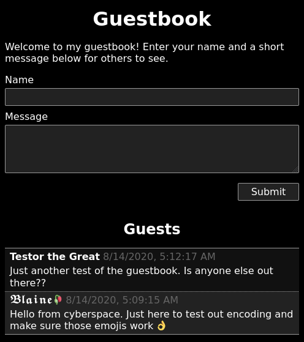

# ESP8266 Guestbook
An ESP8266 based web server that hosts an offline
[guestbook](https://en.wikipedia.org/wiki/Guestbook). WiFi settings,
hosted pages, and guest log are all stored on an SD card. The provided firmware
is written for the Arduino framework and tested on a WeMos D1 Mini clone.

    

## Requirements
To build and flash this firmware you will need
[PlatformIO](https://platformio.org/).

## Hardware
The test hardware is a WeMos D1 Mini clone soldered directly to a micro SD card
adapter. Any ESP8266 hardware should work as long as it has the necesary pins
exposed to attach an SD card.

| SD Pin | ESP8266 Pin | WeMos D1 Pin | Function |
|--------|-------------|--------------|----------|
| 1      | GPIO4       | D2           | SS       |
| 2      | GPIO13      | D7           | MOSI     |
| 3      | GND         | GND          | GND      |
| 4      | 3.3V        | 3.3V         | 3.3V     |
| 5      | GPIO14      | D5           | SCK      |
| 6      | GND         | GND          | GND      |
| 7      | GPIO12      | D6           | MISO     |

## Flashing
Connect the ESP8266 to a host PC and run `platformio run --target upload` to
compile and flash the firmware.

## Configuration
Once assembed and flashed the device is *almost* ready to be used. A FAT32
formatted SD card containing the contents of the `sdcard` directory must be
inserted before applying power. In this directory you will find a file called
`settings.conf` that contains WiFi AP and captive portal settings. This file
is optional and the provided example contains the defaults that will be used if
no file is present. The `sdcard` directory also contains the `www` directory 
which holds the static web content that is served. Edit the provided
example to customize yur guestbook.

## Usage
Insert the prepared SD card and power up the device. Using another WiFi-capable
device connect to the `Guestbook` AP and wait for the prompt to "Sign into this
network". If you don't recieve a prompt you can directly access the web
interface by navigating to `http://guestbook.lan/` (the portal URL and WiFi
SSID will be different if you customized `settings.conf`). On the web interface
you will be able to view all existing guest entries and create new ones.

Saved entries are stored on the SD card in `guests.log`. This file simply
contains each payload POSTed to `/guests.log` separated by a blank line (blank
lines are stripped from the payload before it is written). This may seem a bit
odd, but is done so **any format** of data can be used by the front-end without
the need to make changes to the firmware.

## License
Unless otherwise noted the source in this repository is licensed under the
2-clause BSD license, see `LICENSE` for details.

Note: Arduino libraries **statically linked** by this firmware are licensed
under LGPL.
